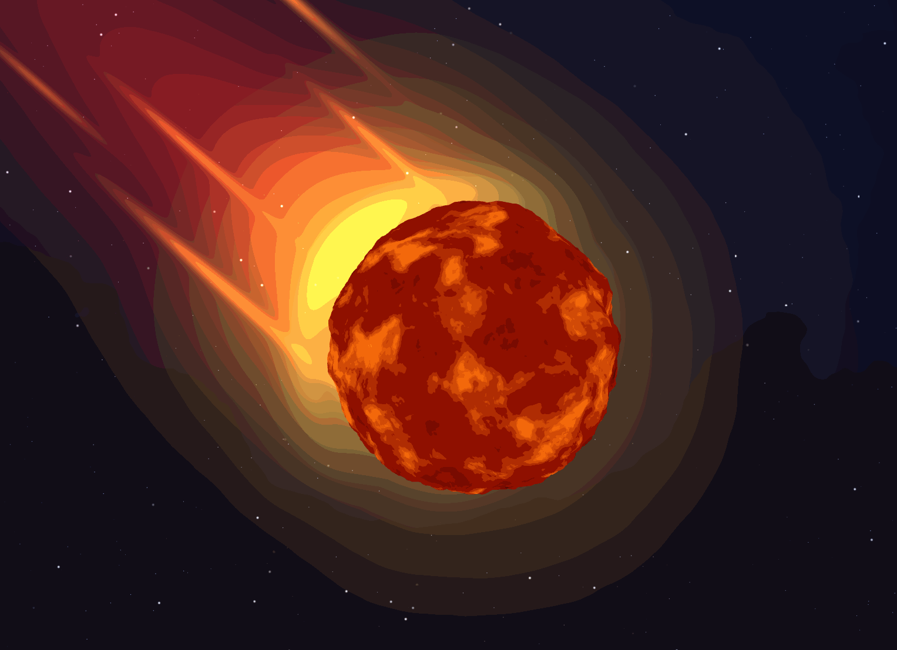
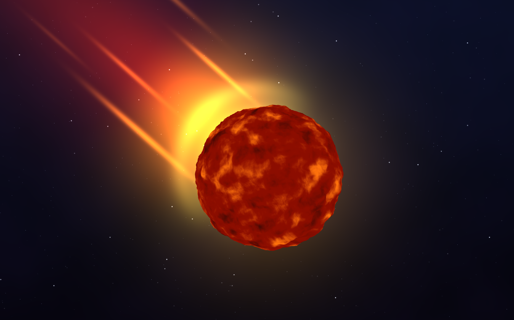
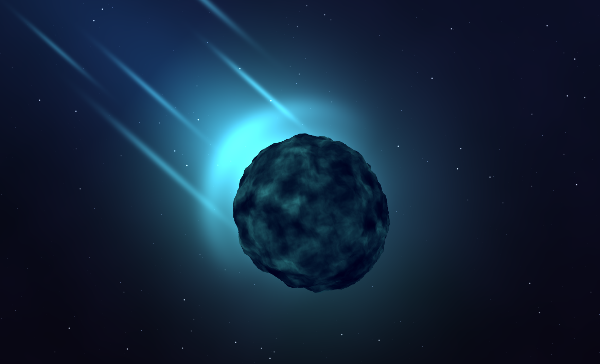
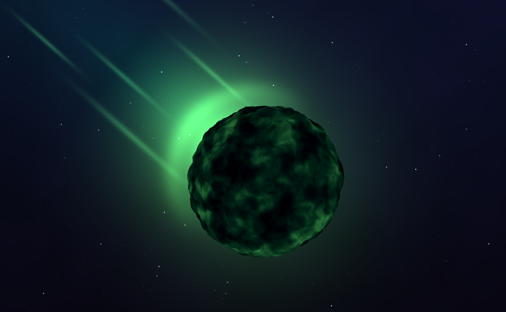
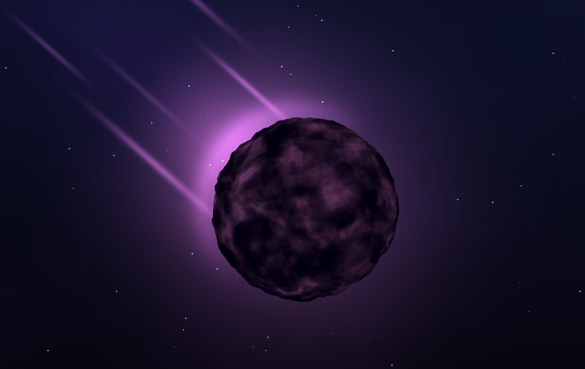

# WebGL Fireball

Anna Dai ([@annaaaddddd](https://github.com/annaaaddddd))

A displaced icosphere shaded as a self-emissive body, over a procedural
starfield background, so the ball reads as a meteor falling through space. See [Live demo](https://annaaaddddd.github.io/WebGL-fireball/) for better view.

<p align="center">
  
</p>

Developed using WebGL2 + TypeScript. 


Run by:
```bash
npm install && npm run dev
```

## Fireball

Vertex shader (`src/shaders/lambert-vert.glsl`) contains two displacement layers, both along the normal:

| Layer | Source | Effect |
|---|---|---|
| Low freq, high amp | `sin(1.1x + t) * sin(0.5y + 1.3t) + sin(2.3z + 0.7t)` | Breaks up the sphere silhouette, breathes over time |
| High freq, low amp | 5-octave FBM over 3D value noise, scrolling along `-y` | Fine surface detail, rolling upward like rising heat |

Their sum goes out as `fs_Displacement` for the fragment shader to read.

Fragment shader (`src/shaders/lambert-frag.glsl`) is self-emissive, no Lambert term:

- Fire texture: domain-warped FBM (one FBM offsets the input of a higher-frequency one), evaluated on
  the *un-displaced* position, so it stays glued to the surface instead of jittering with the geometry.
- Ramp coordinate: `smoothstep(-0.6, 0.85, fs_Displacement)` + the fire value + a
  displacement-phased `sin` shimmer.
- `bias(u_Heat, t)` reshapes that ramp. Low `Heat` → small hot core; high `Heat` → white-hot body.

Artistic design choice: keep the silhouette stable, put the roiling in the fragment shader rather than in heavier geometry noise.

## Procedural background

A second shader program (`src/shaders/background-*.glsl`) draws a fullscreen quad first, depth writes off:

| Element | How |
|---|---|
| Base | Deep navy vertical gradient |
| Nebula haze | FBM with time on the noise's third axis, so it morphs in place instead of sliding |
| Stars | Two cell-based scattering layers (large/sparse, plus small/dense/dimmer to read as farther); each cell hashes out whether it holds a star, where it sits, and its twinkle phase |
| Glow | Theme-tinted Gaussian falloff with a slow pulse, scaled by `Glow Strength` |
| Meteor trail | Wide flare + tight bright core, Gaussian across the axis, exponential fade down it, `smoothstep` onset across the head; hot at the head, cooling toward the tail |
| Rim fire | Thin Gaussian ring on the silhouette, weighted toward the tail side so flames peel off the ball |
| Debris | Five hand-placed elongated Gaussians beside the trail, each with a phase-offset flicker |

Trail, rim weighting and debris all live in screen-space `(s, r)` trail coordinates, which is distance along
the tail axis and perpendicular offset from it, from projecting the pixel onto `TRAIL_DIR` and its
perpendicular. Reaiming the whole meteor means changing one vector.

## Themes

Four themes, one shared `themeColor()` (`src/shaders/color.glsl`) where ball, glow, trail, rim fire and
debris all recolor together.

<table>
  <tr>
    <td></td>
    <td></td>
  </tr>
  <tr>
    <td align="center"><b>Fire</b> — hand-tuned 4-stop gradient</td>
    <td align="center"><b>Ghostfire</b> — deep blue → cyan</td>
  </tr>
  <tr>
    <td></td>
    <td></td>
  </tr>
  <tr>
    <td align="center"><b>Toxic</b> — near-black → acid green</td>
    <td align="center"><b>Cosmic</b> — dark violet → pink lavender</td>
  </tr>
</table>

- Fire: smoke → red → orange → yellow → white, stops blended with `smoothstep` so each transition's position and width is art-directable.
- The other three: Inigo Quilez cosine palettes, custom `c = 0.5` half-period variant, so the palette sweeps monotonically dark → bright over `t` in `[0, 1]`.
- A brightness ramp on top of the palettes keeps the same dark-body / hot-tips structure as Fire.

## Controls (dat.GUI)

Controls are accessible at the top right corner of the live demo. They are organized into folders below, plus a `Click to Reset` button restoring the art-directed defaults.

| Folder | Control | Default | Effect |
|---|---|---|---|
| Shape | `Wobble` | 0.10 | Amplitude of the low-frequency sinusoidal displacement |
| Shape | `Noise Amount` | 0.15 | Amplitude of the FBM detail layer |
| Shape | `Noise Scale` | 5.0 | Spatial frequency of the FBM detail layer |
| Appearance | `Theme` | Fire | Fire / Ghostfire / Toxic / Cosmic |
| Appearance | `Heat` | 0.35 | Bias on the color ramp: hot core size vs. white-hot body |
| Motion | `Speed` | 0.30 | Global animation speed, shared by ball and background |
| Background | `Glow Strength` | 1.0 | Intensity of glow, trail, rim and debris |
| — | `Mesh Detail` | 6 | Icosphere tessellation level (rebuilds the mesh) |

## Toolbox functions used

| Function | Where | Purpose |
|---|---|---|
| Sinusoid combinations | Vertex displacement; flicker, pulse, twinkle | Low-frequency shape layer; all periodic animation |
| Quintic fade `6t⁵-15t⁴+10t³` | `valueNoise3D` | Smooth interpolation between lattice corners |
| `smoothstep` | Displacement normalization, gradient stops, trail onset, rim weighting | Transitions with controllable position and width |
| `bias` | `Heat` control on the color ramp | Pulls midtones down so brightness concentrates at the tips |
| Gaussian | Glow, trail flare and core, rim fire, debris | Falloff with an infinite tail, so there is no visible edge |
| Cosine palette | Ghostfire / Toxic / Cosmic | Three whole palettes out of four `vec3`s |
| `mix` / lerp | Gradient stops, trail hot → cool, nebula blending | Color blending throughout |

Note that since GLSL has no native `#include`, shaders are imported as raw strings and `assembleShader()` in
`src/main.ts` splices in the shared `noise.glsl` / `color.glsl`.

## Credits

- Inigo Quilez, ["Palettes"](https://iquilezles.org/articles/palettes/) — the cosine-palette
  technique `a + b*cos(2pi*(c*t + d))` used for the Ghostfire / Toxic / Cosmic themes.
- Shadertoy ["Fireball" by trisomie21](https://www.shadertoy.com/view/lsf3RH) — inspiration for the
  "stable silhouette + per-pixel surface roiling + corona" approach.
- Toolbox functions from the CIS 5660 Toolbox Functions slides.
- Base code: [CIS 5660 hw01-fireball](https://github.com/CIS-5660-Fall-2026/hw01-fireball).
